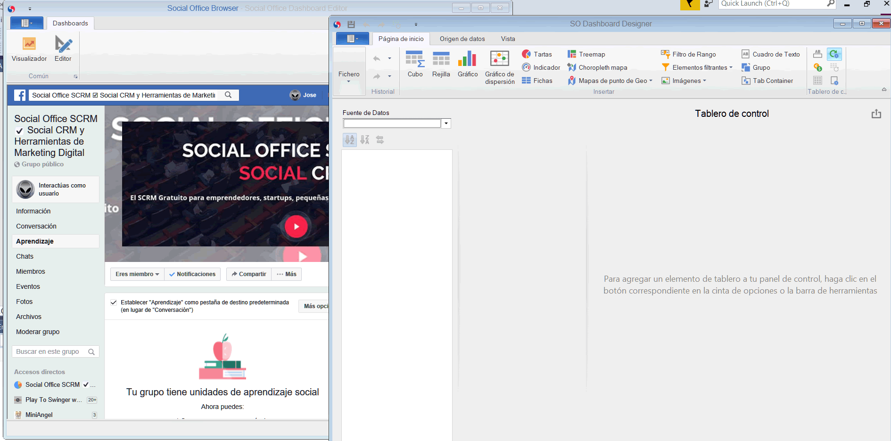

# Social-Office-Dashboard-Editor

Provide a ready-to-use UI for designing and viewing dashboards in WinForms, WPF and ASP.NET applications, save and share in a XML file. Users can create dashboards at runtime and persist them in the application database.

## Requirements

- Window 8.1, 10 and up
- .Net Framework 4.7.2

## License

This project is licensed under the GNU AFFERO GENERAL PUBLIC LICENSE Version 3 - see the [LICENSE.md](/LICENSE.md) file for details.

Made with ❤️ by [Javier Cañon](https://www.javiercanon.com).